# LRDBench Benchmark Flow Diagram

```mermaid
flowchart TD
    %% Main Entry Points
    Start([🚀 Start Benchmark]) --> Entry{Entry Method}
    
    %% Entry Methods
    Entry -->|CLI Script| CLI[📜 Command Line Interface]
    Entry -->|Web Dashboard| Web[🌐 Streamlit Dashboard]
    Entry -->|Python API| API[🐍 Python API]
    Entry -->|Auto-Optimization| Auto[⚡ Auto-Optimized Estimator]
    
    %% Data Generation Phase
    CLI --> DataGen[📊 Data Generation]
    Web --> DataGen
    API --> DataGen
    Auto --> DataGen
    
    DataGen --> Models{Data Model Selection}
    
    Models -->|fBm| FBM[Fractional Brownian Motion]
    Models -->|fGn| FGN[Fractional Gaussian Noise]
    Models -->|ARFIMA| ARFIMA[ARFIMA Model]
    Models -->|MRW| MRW[Multifractal Random Walk]
    Models -->|Neural fSDE| Neural[Neural fSDE Model]
    
    FBM --> Contamination{Apply Contamination?}
    FGN --> Contamination
    ARFIMA --> Contamination
    MRW --> Contamination
    Neural --> Contamination
    
    %% Contamination System
    Contamination -->|Yes| ContamTypes{Contamination Type}
    Contamination -->|No| EstimatorSelection
    
    ContamTypes -->|Additive Noise| AddNoise[➕ Additive Gaussian Noise]
    ContamTypes -->|Multiplicative| MultNoise[✖️ Multiplicative Noise]
    ContamTypes -->|Outliers| Outliers[📈 Outlier Contamination]
    ContamTypes -->|Trend| Trend[📊 Trend Contamination]
    ContamTypes -->|Seasonal| Seasonal[🔄 Seasonal Contamination]
    ContamTypes -->|Missing Data| Missing[❓ Missing Data]
    
    AddNoise --> EstimatorSelection
    MultNoise --> EstimatorSelection
    Outliers --> EstimatorSelection
    Trend --> EstimatorSelection
    Seasonal --> EstimatorSelection
    Missing --> EstimatorSelection
    
    %% Estimator Selection and Auto-Optimization
    EstimatorSelection --> EstimatorCategories{Estimator Category}
    
    EstimatorCategories -->|Temporal| Temporal[⏰ Temporal Estimators]
    EstimatorCategories -->|Spectral| Spectral[📡 Spectral Estimators]
    EstimatorCategories -->|Wavelet| Wavelet[🌊 Wavelet Estimators]
    EstimatorCategories -->|Multifractal| Multifractal[🔢 Multifractal Estimators]
    EstimatorCategories -->|Auto-Optimized| AutoOpt[🚀 Auto-Optimized]
    
    %% Auto-Optimization Flow
    AutoOpt --> OptimizationCheck{Check Available Optimizations}
    
    OptimizationCheck -->|NUMBA Available| NumbaCheck{Test NUMBA}
    OptimizationCheck -->|JAX Available| JaxCheck{Test JAX}
    OptimizationCheck -->|Standard Only| Standard[📋 Standard Implementation]
    
    NumbaCheck -->|Success| NumbaOpt[⚡ NUMBA Optimized]
    NumbaCheck -->|Failure| JaxCheck
    
    JaxCheck -->|Success| JaxOpt[🚀 JAX Optimized]
    JaxCheck -->|Failure| Standard
    
    %% Estimator Implementations
    Temporal --> TemporalImpl[DFA, R/S, DMA, Higuchi]
    Spectral --> SpectralImpl[GPH, Whittle, Periodogram]
    Wavelet --> WaveletImpl[CWT, Wavelet Variance, Wavelet Log Variance, Wavelet Whittle]
    Multifractal --> MultifractalImpl[MFDFA]
    
    NumbaOpt --> Estimation
    JaxOpt --> Estimation
    Standard --> Estimation
    TemporalImpl --> Estimation
    SpectralImpl --> Estimation
    WaveletImpl --> Estimation
    MultifractalImpl --> Estimation
    
    %% Estimation Phase
    Estimation --> EstimationProcess[🔍 Parameter Estimation]
    
    EstimationProcess --> Results{Estimation Success?}
    
    Results -->|Success| SuccessResults[✅ Successful Estimation]
    Results -->|Failure| ErrorHandling[❌ Error Handling & Fallback]
    
    ErrorHandling --> Fallback{Try Fallback?}
    Fallback -->|Yes| Estimation
    Fallback -->|No| ErrorLog[📝 Error Logging]
    
    %% Results Processing
    SuccessResults --> PerformanceLog[📊 Performance Logging]
    ErrorLog --> PerformanceLog
    
    PerformanceLog --> Metrics{Calculate Metrics}
    
    Metrics -->|Hurst Parameter| Hurst[🎯 Hurst Parameter]
    Metrics -->|Confidence Intervals| CI[📏 Confidence Intervals]
    Metrics -->|R-squared| RSquared[📈 R-squared]
    Metrics -->|Convergence Rates| Convergence[🔄 Convergence Rates]
    Metrics -->|Mean Signed Error| MSE[📊 Mean Signed Error]
    Metrics -->|Execution Time| ExecTime[⏱️ Execution Time]
    Metrics -->|Memory Usage| Memory[💾 Memory Usage]
    Metrics -->|Speedup| Speedup[🚀 Performance Speedup]
    
    Hurst --> ResultsAggregation
    CI --> ResultsAggregation
    RSquared --> ResultsAggregation
    Convergence --> ResultsAggregation
    MSE --> ResultsAggregation
    ExecTime --> ResultsAggregation
    Memory --> ResultsAggregation
    Speedup --> ResultsAggregation
    
    %% Results Aggregation and Output
    ResultsAggregation --> Aggregation[📋 Results Aggregation]
    
    Aggregation --> OutputFormats{Output Format}
    
    OutputFormats -->|CSV| CSV[📄 CSV Export]
    OutputFormats -->|JSON| JSON[📋 JSON Export]
    OutputFormats -->|HTML Report| HTML[🌐 HTML Report]
    OutputFormats -->|Interactive Plot| Plot[📊 Interactive Plot]
    OutputFormats -->|Dashboard| Dashboard[🎛️ Dashboard Display]
    
    %% Final Outputs
    CSV --> FinalResults[📊 Final Results]
    JSON --> FinalResults
    HTML --> FinalResults
    Plot --> FinalResults
    Dashboard --> FinalResults
    
    %% Analytics and Monitoring
    FinalResults --> Analytics[📈 Analytics & Monitoring]
    
    Analytics --> UsageTracking[👥 Usage Tracking]
    Analytics --> PerformanceMonitoring[⚡ Performance Monitoring]
    Analytics --> QualityMetrics[🎯 Quality Metrics]
    
    UsageTracking --> Summary[📋 Benchmark Summary]
    PerformanceMonitoring --> Summary
    QualityMetrics --> Summary
    
    Summary --> End([🏁 Benchmark Complete])
    
    %% Styling
    classDef startEnd fill:#e1f5fe,stroke:#01579b,stroke-width:2px
    classDef process fill:#f3e5f5,stroke:#4a148c,stroke-width:2px
    classDef decision fill:#fff3e0,stroke:#e65100,stroke-width:2px
    classDef data fill:#e8f5e8,stroke:#1b5e20,stroke-width:2px
    classDef optimization fill:#fff8e1,stroke:#f57f17,stroke-width:2px
    classDef error fill:#ffebee,stroke:#c62828,stroke-width:2px
    classDef output fill:#f1f8e9,stroke:#33691e,stroke-width:2px
    
    class Start,End startEnd
    class DataGen,Estimation,ResultsAggregation,Analytics process
    class Entry,Models,Contamination,ContamTypes,EstimatorCategories,OptimizationCheck,NumbaCheck,JaxCheck,Results,Fallback,OutputFormats decision
    class FBM,FGN,ARFIMA,MRW,Neural,TemporalImpl,SpectralImpl,WaveletImpl,MultifractalImpl data
    class NumbaOpt,JaxOpt,Standard optimization
    class ErrorHandling,ErrorLog error
    class CSV,JSON,HTML,Plot,Dashboard,FinalResults,Summary output
```

## Key Components of the LRDBench Benchmark Flow

### 🚀 **Entry Points**
- **CLI Scripts**: Command-line interface for batch processing
- **Web Dashboard**: Interactive Streamlit interface
- **Python API**: Direct programmatic access
- **Auto-Optimized Estimator**: Intelligent optimization selection

### 📊 **Data Generation**
- **5 Stochastic Models**: fBm, fGn, ARFIMA, MRW, Neural fSDE
- **Contamination System**: 6 types of data contamination for robustness testing
- **Parameter Control**: Configurable model parameters

### ⚡ **Auto-Optimization System**
- **NUMBA Optimization**: JIT compilation for maximum performance
- **JAX Optimization**: GPU acceleration for large-scale data
- **Standard Fallback**: Robust error handling with graceful degradation
- **Performance Monitoring**: Real-time speedup tracking

### 🔍 **Estimator Categories**
- **Temporal (4)**: DFA, R/S, DMA, Higuchi
- **Spectral (3)**: GPH, Whittle, Periodogram  
- **Wavelet (4)**: CWT, Wavelet Variance, Wavelet Log Variance, Wavelet Whittle
- **Multifractal (1)**: MFDFA

### 📋 **Results Processing**
- **Comprehensive Metrics**: Hurst parameter, confidence intervals, R-squared, convergence rates, mean signed error
- **Performance Analytics**: Execution time, memory usage, speedup ratios
- **Multiple Output Formats**: CSV, JSON, HTML, interactive plots
- **Quality Assessment**: Robustness testing and error analysis

### 📈 **Analytics & Monitoring**
- **Usage Tracking**: Monitor estimator performance and usage patterns
- **Performance Monitoring**: Real-time optimization effectiveness
- **Quality Metrics**: Comprehensive benchmark summary and statistics

This flow diagram showcases the sophisticated architecture of LRDBench, highlighting its auto-optimization capabilities, comprehensive contamination testing, and robust error handling mechanisms.